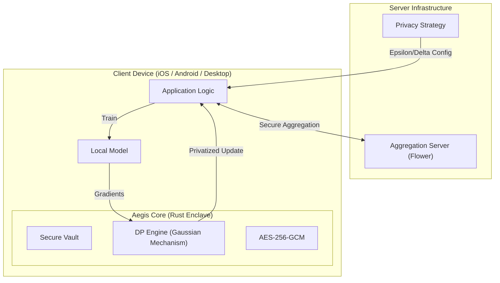

# 🛡️ AEGIS
> **The Fortress for Your Data.**
> *Next-Generation Privacy-Preserving Infrastructure for the AI Era.*

[](https://opensource.org/licenses/MIT)
[](https://www.rust-lang.org/)
[](https://www.python.org/)
[](docs/MOBILE.md)
[](docs/ENCRYPTION.md)

**Aegis** is an enterprise-grade, zero-trust infrastructure designed to enable **Federated Learning (FL)** and secure data storage on untrusted devices. It bridges the gap between high-level AI research (Python/PyTorch) and military-grade verified security (Rust).

---

## 🚀 Why Aegis?

Traditional crypto-systems are slow or hard to integrate. Pure Python implementations leak memory and are vulnerable to inspection. **Aegis** solves this with a **Hybrid Core Architecture**:

| Feature | Traditional Solutions | 🛡️ Aegis |
| :--- | :--- | :--- |
| **Encryption** | File-level (slow) | **Stream-based Chunks (Instant)** |
| **Privacy** | Simulated Noise (Python) | **Verified Rust Gaussian Mechanism** |
| **Platform** | Server/Desktop only | **Native Mobile (iOS/Android) + Desktop** |
| **Memory Safety** | Vulnerable (GC) | **Zeroize™ (RAM Scrubbing)** |
| **Performance** | Interpreter Speed | **Native Rust Speed** |

---

## 🌟 Key Features

### 🔒 Secure Vault Engine (`aegis-engine`)
Built in **Rust** for maximum safety and speed.
*   **Streaming Encryption**: Encrypts multi-gigabyte datasets with constant RAM usage.
*   **Crypto-Shredding**: Delete the key, and the data is mathematically gone forever.
*   **Sanitized Storage**: Physical files use UUIDs to prevent directory traversal attacks.

### 📱 Native Mobile Support (`Uniffi-Bindgen`)
Run the exact same security core on mobile devices.
*   **iOS**: Native Swift bindings (`AegisMobile`).
*   **Android**: Native Kotlin bindings (`com.aegis.engine`).
*   **Single Codebase**: Write logic once in Rust, deploy everywhere via UniFFI.

### 🧠 Privacy-Preserving Federated Learning (`aegis-core`)
Orchestrated in **Python** (server) and **Rust** (client privacy).
*   **Secure DP-SGD**: Differential Privacy noise injection happens inside the Rust conclave.
*   **Server Strategy**: Custom Flower (`flwr`) strategy for distributing privacy budgets.
*   **Performance**: Privacy operations take <3ms per update.

### 🌐 Distributed Coordination (`aegis-server`)
Reliable aggregation infrastructure for real-world deployment.
*   **Crash Recovery**: Server automatically restores state from the latest checkpoint (`model_round_X.npz`) on startup.
*   **Model Versioning**: Every training round is strictly versioned and persisted.
*   **Fault Tolerance**: Robust handling of client dropouts and connection timeouts.

---

## 🏗 Architecture

Aegis uses a "Sandwiched" architecture where the secure Rust core wraps the sensitive data, offering a safe API to the Python AI layer and Mobile Apps.



---

## ⚡ Getting Started

### Prerequisites
*   **Rust**: 1.70+ (`curl --proto '=https' --tlsv1.2 -sSf https://sh.rustup.rs | sh`)
*   **Python**: 3.10+
*   **Xcode** (for iOS) / **Android Studio** (for Android)

### Installation

1.  **Clone & Setup**
    ```bash
    git clone https://github.com/Lingikaushikreddy/Aegis.git
    cd Aegis
    ```

2.  **Build the High-Performance Core**
    ```bash
    cd aegis-engine
    cargo build --release
    # Verify system integrity tests
    cargo test
    ```

3.  **Install Python Dependencies (FL)**
    ```bash
    pip install -r requirements.txt
    ```

### Usage Example: Privacy-Preserving Training

```python
# Clients automatically use the Rust Engine for privacy
# See aegis-core/aegis_core/ai/fl_client.py

from engine import aegis_engine

# 1. Initialize Rust Privacy Kernel
core = aegis_engine.FlClientCore(data_path="./data", dp_sigma=1.0, dp_threshold=5.0)

# 2. Privatize Model Update (happens inside training loop)
# Rust handles clipping and noise injection securely
privatized_result = core.privatize_update(rust_weights)
print(f"Update Secured. Privacy Budget Consumed.")
```

### Usage Example: Distributed Coordinator

The Aegis Server acts as a fault-tolerant coordinator. It automatically creates `checkpoints/` and `logs/`.

```bash
# Start the server (Requires TLS certs or edit to run insecure)
python3 -m aegis_server.server

# To verify Recovery:
# 1. Stop the server (Ctrl+C)
# 2. Restart it. It will find the latest checkpoint and resume.
```

---

## 🗺️ Roadmap

- [x] **Phase 1: Foundation** - Rust Core, AES-GCM, Basic Vault.
- [x] **Phase 2: Hardening** - Streaming I/O, Path Sanitization, Memory Zeroing.
- [x] **Phase 3: Mobile & Bindings** - UniFFI for iOS (Swift) & Android (Kotlin).
- [x] **Phase 4: Federated Learning** - DP-SGD Pipeline, Flower Integration, Server Strategy.
- [x] **Phase 5: Distributed Systems** - Checkpointing, Crash Recovery, Fault Tolerance.
- [ ] **Phase 6: Network Layer** - Libp2p implementation for decentralized storage.
- [ ] **Phase 7: Secure Aggregation** - Multi-Party Computation (MPC) for stronger guarantees.

---

## 🤝 Contributing

Security is our top priority.
*   **Report Vulnerabilities**: Please create a draft security advisory on GitHub.
*   **Code Style**: 
    *   Rust: `cargo fmt` & `cargo clippy`
    *   Python: `black` & `mypy`

## 📄 License

Licensed under MIT. See [LICENSE](LICENSE) for details.

---
*Built with ❤️ by the Aegis Team.*
