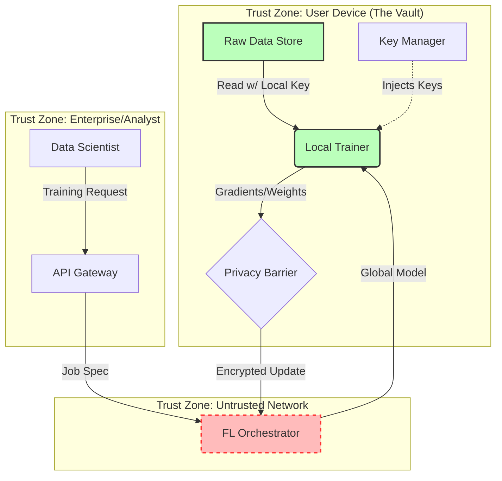

# VAULTED

> **Personal Data Trust Infrastructure for the AI Era.**

[](https://opensource.org/licenses/MIT)
[](https://www.python.org/downloads/)
[](https://github.com/psf/black)

**VAULTED** is a privacy-first infrastructure that enables **Federated Learning (FL)** on personal data without that data ever leaving the user's device. We implement a **"Compute-to-Data"** paradigm where model training occurs locally within a secure "Vault," and only encrypted model updates are shared.

## 🏗 System Architecture

The system is composed of three main layers. For a deep dive, see the [Architecture Design Document](docs/architecture.md).



1.  **Vault Core (`vaulted-core`)**: 
    - A secure, local daemon running on the user's device.
    - Manages **AES-256** encrypted file storage.
    - Executes local PyTorch training loops.
    - **Zero Trust**: Keys are managed via OS Keychain; raw data never exits the vault.

2.  **FL Orchestrator (`vaulted-server`)**:
    - A centralized server using **Flower (flwr)** to manage federation rounds.
    - Aggregates model updates (weights) from thousands of vaults.
    - Cannot inspect individual data samples.

3.  **Enterprise Gateway (`vaulted-gateway`)**:
    - A compliant API surface for enterprises to request model training.
    - Manages consent, billing, and audit logs.

## 🚀 Getting Started

### Prerequisites
- Python 3.10+
- `pip` or `conda`

### Installation

```bash
# Clone the repository
git clone https://github.com/Lingikaushikreddy/Vaulted.git
cd Vaulted

# Install dependencies
pip install -r requirements.txt
```

### Running the Vault (Client)

```bash
# Set PYTHONPATH
export PYTHONPATH=$PYTHONPATH:$(pwd)/vaulted-core

# Run the integration test (simulates a full flow)
python test_vault_core.py
```

### Running the FL Server

```bash
export PYTHONPATH=$PYTHONPATH:$(pwd)/vaulted-server
python -m vaulted_server.server
```

## 🔐 Security & Compliance

- **Encryption at Rest**: AES-256-GCM.
- **Secure Key Management**: Integrated with OS Keyring.
- **Compliance Engine**: 
    - Automated GDPR/CCPA checks.
    - Data Minimization enforcement.
    - PDF Report generation.
- **Audit Logging**: Immutable SQLite ledger.

## 🤝 Contributing

Contributions are welcome! Please read the architecture doc before submitting PRs.

## 📄 License

This project is licensed under the MIT License - see the LICENSE file for details.
