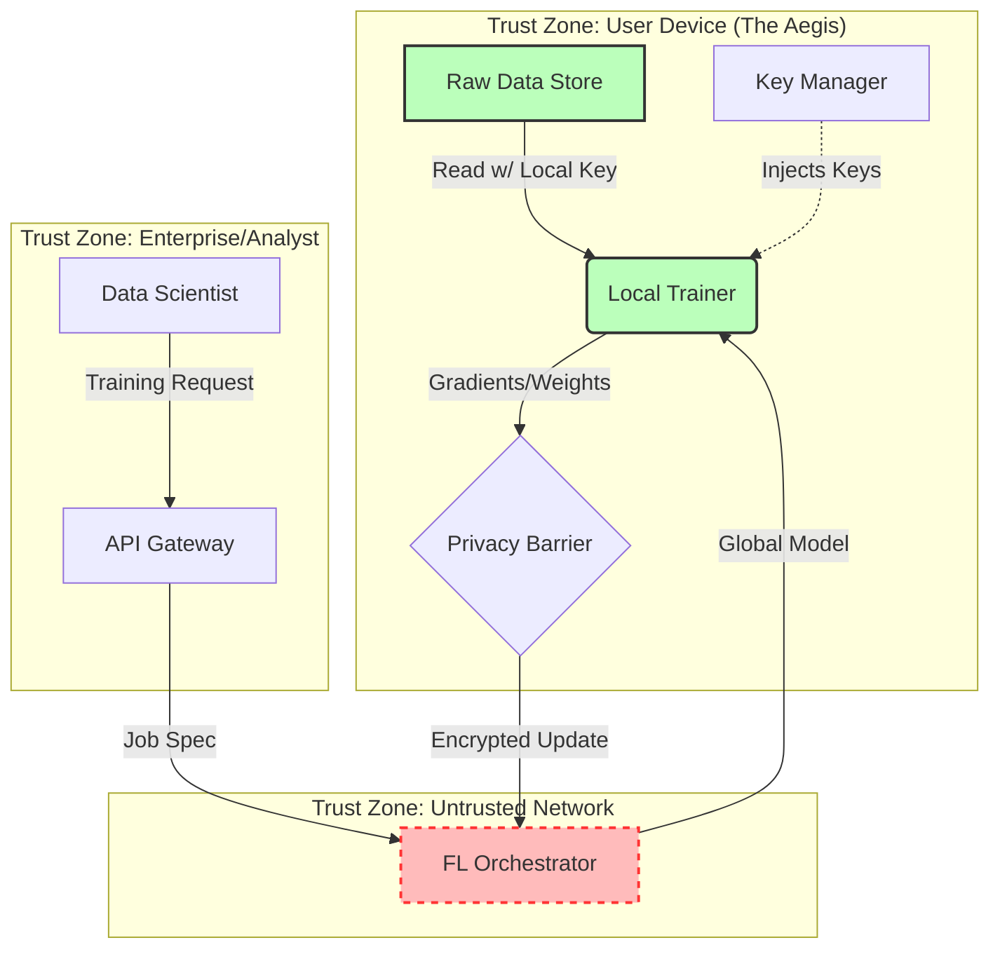

# AEGIS - System Architecture Document (SAD)

**Role**: Senior Principal Systems Architect
**Date**: 2025-12-27
**Status**: DRAFT (Pending Approval)

---

## 1. Executive Summary
AEGIS is a **decentralized data trust infrastructure** designed to enable high-utility AI training without compromising user privacy. It operates on a **"Compute-to-Data"** paradigm where raw data never leaves the user's secure aegis. The architecture prioritizes **Zero Trust** principles, assuming that the network and even the orchestration server can be untrusted entities regarding raw data access.

## 2. Trust Model & Zero Trust Boundaries

### 2.1 Core Axioms
1.  **User Sovereignty**: User is the sole owner of the decryption keys for their data.
2.  **Zero Trust Storage**: Data at rest is encrypted. The physical storage medium (disk/cloud) cannot read the data.
3.  **Trustless Aggregation**: The FL Server performs mathematical aggregation but cannot inspect individual updates (requires Secure Aggregation).
4.  **Verifiable Compute**: Code sent to the client (model definitions) must be signed and verified before execution to prevent remote code execution (RCE) attacks.

### 2.2 Trust Boundaries Diagram

## 3. Data Flow & Component Contracts

### 3.1 Data Flow: The Training Cycle
1.  **Request**: Enterprise sends `JobSpec` (Model Architecture + Hyperparams + Target Cohort) to `API Gateway`.
2.  **Consent Check**: Gateway verifies `JobSpec` against `ConsentRegistry` (Blockchain/Ledger).
3.  **Dispatch**: `FL Orchestrator` broadcasts `JobSpec` to eligible `Aegis Clients`.
4.  **Verification**: `Aegis Client` verifies cryptographic signature of the `JobSpec`.
5.  **Local Compute**:
    *   Decrypt local data into memory (RAM only).
    *   Run forward/backward pass.
    *   Generate `ModelUpdate` (Weights).
    *   Drop raw data from memory immediately.
6.  **Privacy Injection**: Apply **Differential Privacy (DP)** noise (optional but recommended) or encrypt for **Secure Aggregation**.
7.  **Aggregation**: `FL Orchestrator` aggregates updates.
8.  **Result**: Global model updated.

### 3.2 Component Contracts

#### A. The Aegis (Client)
*   **Responsibility**: Data Custody, Local Compute.
*   **Interface**: `gRPC` (Flower Client).
*   **Storage Schema**:
    *   `blobs/`: AES-256-GCM encrypted files.
    *   `meta.db`: SQLite (SQLCipher) for indexing.
*   **Hardware Constraint**: Must run on consumer hardware (CPU/Metal/CUDA).

#### B. The Orchestrator (Server)
*   **Responsibility**: User Selection, Model Aggregation, Global Model Storage.
*   **Interface**: `gRPC` (Flower Server), `REST` (Control Plane).
*   **Constraint**: Stateless aggregation preferred for scalability.

#### C. The Gateway (Enterprise Access)
*   **Responsibility**: AuthZ, Billing, Audit Logging.
*   **Interface**: `REST` (FastAPI).
*   **Security**: mTLS authentication with Enterprise Partners.

## 4. Threat Model

| Threat Agent | Attack Vector | Mitigation Strategy |
| :--- | :--- | :--- |
| **Malicious Server** | Model Poisoning (sending bad models to extract data) | **Client-Side Verification**: Clients only accept signed jobs from known registries. |
| **Malicious Server** | Gradient Inversion (reconstructing inputs from updates) | **Secure Aggregation**: Server only sees $\sum W_i$, not individual $W_i$. **Local DP**: Add noise to gradients. |
| **Compromised Client** | Key Exfiltration | **Hardware Security Module (HSM)** / Secure Enclave usage for key storage (Future Scope). |
| **Data Scientist** | Overfitting to extract PII | **Privacy Budget**: Limit number of queries/training rounds per user. |

## 5. Technology Stack Decisions (Principal Tradeoffs)

### 5.1 Communication Protocol: gRPC vs REST
*   **Decision**: **gRPC** (via Flower).
*   **Reasoning**: Bidirectional streaming is essential for FL training loops. Lower overhead for large weight payloads. REST is defined ONLY for the external Enterprise Control Plane.

### 5.2 Local Database: SQLite vs JSON/Flatfile
*   **Decision**: **SQLite (async via aiosqlite)**.
*   **Reasoning**: We need structured querying to select data subsets (e.g., "Train on emails from 2024"). Flatfiles are inefficient for querying.

### 5.3 Cryptography
*   **Standard**: **AES-256-GCM** for data at rest. **TLS 1.3** for transport.
*   **Tradeoff**: GCM offers integrity but is slower than CTR. Integrity is non-negotiable here.

## 6. Next Steps (Roadmap)
1.  **Harden the Aegis**: Replace static keys with OS Keychain integration.
2.  **Data Ingestion Engine**: Build "Connectors" (e.g., PDF parser, CSV importer) to turn raw files into training tensors.
3.  **Secure Aggregation**: Upgrade the FL loop to use Flower's SecAgg protocols.
